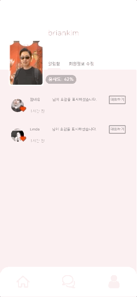

# 나는 어때(How About Me)

<div style="text-align: center;">
  
 </div>

**나는 어때**는 기존의 소개팅 애플리케이션들에서 가짜 프로필 사진이나 실물과 전혀 다른 프로필 사진으로 겪었던 불편함을 해소해줄 새로운 소개팅 애플리케이션입니다. 저희 서비스는 실제 사용자의 실물과 사용자가 업로드한 프로필 사진의 유사도를 측청하고 해당 유사도를 모든 사용자들에게 제공함으로써 앞서 말했던 불편함을 해소해주고 더욱 더 신뢰있는 소개팅 서비스를 제공하고 있습니다. 나는 어때와 함께 눈속임 없는 소개팅을 경험해보세요!

**How About Me** is a new type of social dating service that will free you from the stress came from fake profiles or profiles that is way different from actual appearance of user. Our service measures similarity between one user's uploaded profile pictures from his/her actual appearance then provide it to all users using our service. Therefore, we provide much reliable social dating environment and free every user from stress about what we metioned earlier. Experience scam free social dating with our service!


## 1. 사용 화면

다음은 실제 서비스가 구동되는 예시입니다. 

### 1-1. 상세 프로필 기입

저희 서비스를 이용하기 위해서는 필수적으로 회원가입/로그인을 해야합니다. 새로운 유저의 경우 회원가입 단계에서 자신의 상세 프로필을 기입합니다. 


### 1-2. 유사도 측정

유사도 측정은 회원가입 과정에서 상세 프로필 기입이 완료된 후 진행됩니다. 먼저 자신의 프로필 사진을 업로드한 뒤 자신의 실물 사진을 스마트폰 카메라를 통해 촬영한 후 유사도 측정이 이루어집니다.


### 1-3. 상대방 찾기

**나는 어때**의 메인페이지에서 소개팅 상대를 확인 할 수 있습니다. 좌우 스크롤을 통해 새로운 상대방을 볼 수 있습니다. 현재 페이지에 나타난 상대방을 다 본후에는 다른 매칭 상대 보기를 클릭하여 새로운 상대들을 볼 수 있습니다. 상대방 프로필 사진 하단 가운데 위치한 숫자는 상대방의 실물과 대표 사진과의 유사도를 측정한 수치입니다. 이를 통해 프로필 사진과 실물이 비슷한 유저를 파악할 수 있습니다.


### 1-4. 상대방 프로필 확인

상대방 프로필을 보려면 메인페이지에 나타난 상대방 사진의 왼쪽에 있는 하늘색 버튼을 클릭합니다. 해당 버튼을 클릭하게 되면 상대방의 자세한 프로필이 나타나고 사진 밑에 있는 화살표를 클릭하면 원본 크기의 프로필 사진을 볼 수 있습니다.


### 1-5. 마음에 드는 상대방과 대화하기

자신의 마음에 드는 상대방과 대화를 나누기 위해서는 상대방의 허락이 필요합니다. 상대방 프로필에 있는 하트를 누르면 좋아요메세지가 전송되니다. 상대방은 자신에게 온 좋아요 메세지를 확인하고 대화를 시작할 수 있습니다.

- 상대방에게 하트 누르기

  

- 좋아요 메세지 확인하고 대화하기

  

- 실시간 대화 장면

  


## 2. 기술 스택

저희 **나는 어때** 개발에 사용된 기술들에 대해 소개해드리겠습니다.

- Vue.js 

- Django

- Node.js

- simple-peer

- socket.io

- MariaDB

- OpenCV

  

# 설치

저희 서비스의 프론트엔드는 Vue.js 프레임워크, 그리고 백엔드는 Django, Node.js 프레임워크가 사용되었습니다. 해당 섹션에서는 프론트엔드와 백엔드 서버 설치법에 대해 안내해드리겠습니다.

Our service is built with Vue.js (front-end) and Django (back-end). In this section, we will introduce how we install and run front-end script and backend server.

## Front-end 설치

프론트엔드 스크립트를 실행시키려면 front 디렉토리로 이동하세요. 해당 디렉토리로 이동후에는 다음의 명령어로 node 패키지들을 설치합니다.

Move to `front` directory in order to run front-end script. At 'front' directory, type following command in to terminal in order to install node.js packages.

```
npm install 
```

Node 패키지들이 설치된 후에는 바로 스크립트를 실행시킬 수 있습니다.

Type following command to run the script.

```
npm run serve
```


## Back-end 설치

**나는 어때**의 서버는 메신저 서비스를 위한 웹소켓 서버와 HTTP 요청을 위한 서버로 구성되어있습니다. 그러므로 두개의 서버를 설치하고 실행하는 방법에 대해 소개해드리겠습니다.

### HTTP Server

먼저 HTTP 요청을 위한 서버입니다. 해당 서버 설치를 위해 `backend/backend` 디렉토리로 이동하세요. 그리고 해당 디렉토리에서 다음의 명령어를 통해 서버 실행에 필요한 패키지들을 설치해주세요.

```
pip install -i requirements.txt
```

설치가 완료되면 다음의 명령어를 통해 서버를 실행할 수 있습니다.

```
python manage.py runserver
```

서버가 실행되지만 데이터베이스의 경우 개인적으로 설정 후 migration을 해주세요. 자세한 사항은 Django 프레임워크 공식 문서를 참조해주시길 바랍니다.

### Websocket Server

다음은 웹소켓 서버 설치 방법입니다. 설치를 위해 `~/websocket` 디렉토리로 이동해주세요. 해당 디렉토리에서 다음 명령어를 통해 서버 실행에 필요한 node 패키지들을 설치합니다.

```
npm install
```

패키지들이 설치 완료된 후에는 다음의 명령어를 통해 서버를 실행시킵니다.

```
npm run serve
```


# 설정

**나는 어때**를 설치하고 정상적으로 실행시키기 위해서는 다음 항목들의 설정이 필요합니다.

- 백엔드 서버 데이터 베이스 설정
- 웹소켓 서버 데이터 베이스 설정
- 프론트엔드
  - 백엔드 서버 주소 설정
  - 웹소켓 서버 주소 설정

## 1. 백엔드 서버 데이터 베이스 설정

백엔드 서버와 통신할 데이터 베이스 설정이 필요하며 관계형 데이터 베이스가 필요합니다. 백엔드 서버 데이터 베이스 설정을 위해 `backend/backend/api/setting.py` 를 열어 다음의 부분을 수정해주세요.

```python
#settings.py
DATABASES = {
    'default': {
      	# 기본 Django 데이터 베이스 사용을 원할시
      	# 다음 2줄을 comment out 해주세요.
        # 'ENGINE': 'django.db.backends.sqlite3',
        # 'NAME': BASE_DIR / 'db.sqlite3',
				
      	# 커스텀 데이터베이스를 이용할 경우 다음 항목들을 작성해주세요.
        'ENGINE': 'django.db.backends.{your database}', #mysql 사용시 django.db.backends.mysql
        'NAME': '', #데이터베이스 이름
        'USER': '', #데이터베이스 사용자 이름
        'PASSWORD': '', #데이터베이스 비밀번호
        'HOST': '', #데이터베이스 주소
        'PORT': '', #데이터베이스 포트 번호
    }
}

```


# 개발자들

- 김연수 - 백엔드 개발
- 김나연 - 프론트엔드 개발
- 김민재 - 프론트엔드 개발
- 남동규 - 프론트엔드 개발
- 류승민 - 백엔드 및 유사도 측정 개발


# License

The MIT License

Copyright 2020 Yeonsu Kim, Nayeon Kim, Minze Kim, Dongkyu Nam, Seungmin Ryu

Permission is hereby granted, free of charge, to any person obtaining a copy of this software and associated documentation files (the "Software"), to deal in the Software without restriction, including without limitation the rights to use, copy, modify, merge, publish, distribute, sublicense, and/or sell copies of the Software, and to permit persons to whom the Software is furnished to do so, subject to the following conditions:

The above copyright notice and this permission notice shall be included in all copies or substantial portions of the Software.

THE SOFTWARE IS PROVIDED "AS IS", WITHOUT WARRANTY OF ANY KIND, EXPRESS OR IMPLIED, INCLUDING BUT NOT LIMITED TO THE WARRANTIES OF MERCHANTABILITY, FITNESS FOR A PARTICULAR PURPOSE AND NONINFRINGEMENT. IN NO EVENT SHALL THE AUTHORS OR COPYRIGHT HOLDERS BE LIABLE FOR ANY CLAIM, DAMAGES OR OTHER LIABILITY, WHETHER IN AN ACTION OF CONTRACT, TORT OR OTHERWISE, ARISING FROM, OUT OF OR IN CONNECTION WITH THE SOFTWARE OR THE USE OR OTHER DEALINGS IN THE SOFTWARE.